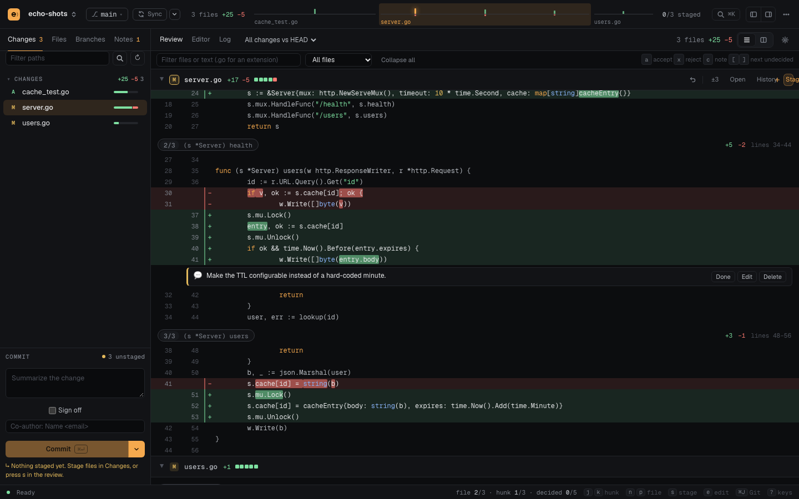
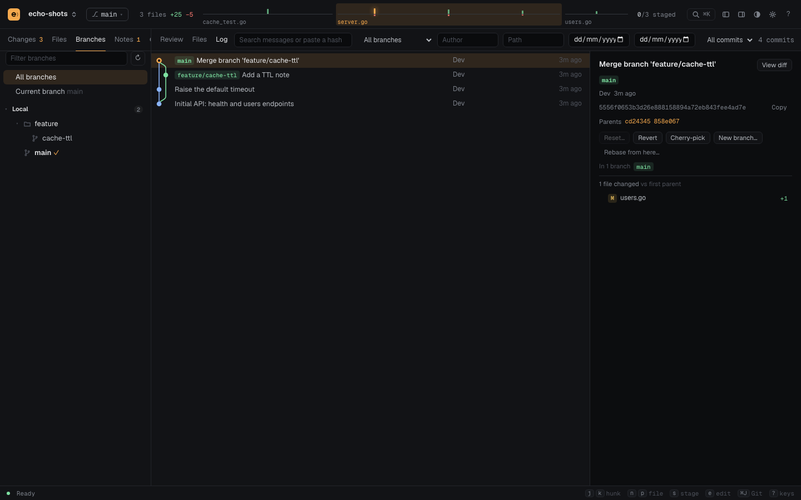
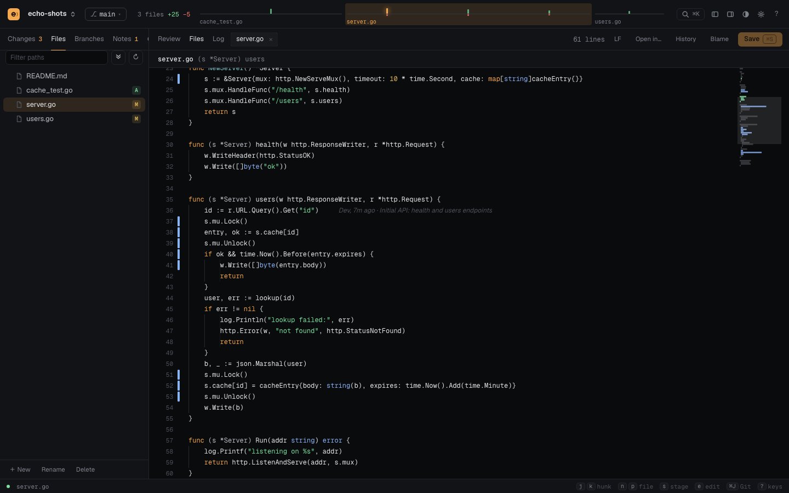

# echo

A small local-first proof desk for reviewing code written by coding agents, on macOS and Linux.



## Install

macOS and Linux (arm64 and amd64). The command is `echo-desk`, so it never collides with your shell's `echo`.

```sh
# Homebrew
brew install sidkhuntia/tap/echo-desk

# or the install script (verifies the release checksum; installs to ~/.local/bin)
curl -fsSL https://raw.githubusercontent.com/sidkhuntia/echo/main/install.sh | sh
```

Or download `echo-desk_<version>_<darwin|linux>_<arch>.tar.gz` from [Releases](https://github.com/sidkhuntia/echo/releases), check it against `checksums.txt`, and put `echo-desk` on your `PATH`.

From source (Go 1.25+):

```sh
go build -o "$(go env GOPATH)/bin/echo-desk" .
```

`echo-desk -version` prints the installed version. Update with `brew upgrade echo-desk` or by running the install script again; open pages reload themselves when the new version starts.

## Open any repository

echo serves the directory it starts in, or the one you pass:

```sh
cd ~/code/my-project && echo-desk
echo-desk ~/code/my-project
```

It opens your browser at `http://127.0.0.1:6030`. Each process serves one repository. Start echo in another repository and it takes the next free port (up to 6049) in a new tab; start it in a repository that is already open and it just opens that tab. Click the repository name in the title bar (`⌘⇧O`) to switch between open repositories. What you were doing in each (open files, unsaved edits, scroll positions, review notes) is kept and comes back when you return.

| Flag | Default | Meaning |
| --- | --- | --- |
| `-port` | auto | Port to listen on (always `127.0.0.1`). Auto means the repository's last port, else the first free one in 6030–6049 |
| `-no-open` | off | Print the URL instead of opening the browser |

- A directory that is not a Git repository still opens, as a plain file browser and editor.
- Theme, editor and layout settings are global and shared by every repository.
- The printed link carries a per-user secret (`?t=…`, stored `0600` in echo's config directory). It becomes a cookie, so other users and processes on the machine cannot call echo's API.
- While developing echo itself, `go run . -no-open` runs it from source in the current directory.

## The review loop

1. An agent changes files. echo shows them as they change: the **Review** is one scrolling diff with a trace of every file and hunk in the title bar.
2. Go hunk by hunk (`j`/`k`). leave a **note** (`c`, or click the sign column of a line), **stage a hunk or just some of its lines** (click line numbers to pick lines, `c` then notes exactly those), or **discard** a hunk. Changed words are marked inside changed lines. Notes can also go on a whole file (a to-do, from its header), or on lines you select in the editor (**Note**, `⌘⌥M`); a dot in the editor gutter shows where they are. Notes describe your working tree, so they are written on All changes or Unstaged, not on a commit.
3. **Notes → Copy for agent** puts every open note on the clipboard with its file, line and the code you were looking at, wrapped in instructions that tell the agent to change only what each note asks, answer questions instead of guessing, and leave staging and commits to you. **Copy notes** gives just the list.
4. Commit what you accept. Anything you discard is snapshotted first, and **Restore** in the Changes list brings it back.



## Git

Stage, unstage and discard by file, hunk or line · commit, amend (or amend keeping the message), undo the last commit, sign-off and co-author trailers, a message length meter and your `commit.template` · merge (fast-forward, `--no-ff` or squash), rebase, **interactive rebase** (reorder, squash, fixup, reword, drop), cherry-pick, revert · a bar for any merge, rebase, cherry-pick or revert in progress with Continue, Skip and Abort · **conflict resolution** (accept current, incoming or both per conflict, or take a whole file's side) · branches (create, rename, delete with a list of what a force delete would lose, delete on the remote), stash (selected files, show, branch, pop), reset soft, mixed or hard · fetch, pull (fast-forward only, rebase or merge), push (tags, set upstream, force with or without lease), publish · remotes, worktrees, submodules, reflog and a PR-style **Compare** in the Git panel's Tools tab · Log filters (message, author, path, dates, merges), a right-click menu on every commit, and files restored from any commit.

## Editor

Syntax highlighting, change bars against HEAD or the index, inline blame, find and **replace** (and replace across files) · auto-indent, bracket and quote closing, comment toggle, move, duplicate and delete lines, jump to the matching bracket, **multiple cursors** · indent detection and settings, line-ending indicator and conversion, trim trailing whitespace and final newline on save, autosave · minimap, indent guides, ruler, visible whitespace, sticky scroll, breadcrumbs, highlighting of other uses of a word · **Vim mode** · Markdown, CSV and image previews, JSON formatting, a read-only side view · rename, duplicate, delete, drag-to-move, reveal and open in another editor from the tree · recent files, reopen closed tab, and a **command palette** (`⌘⇧P`) with every action.



## Keyboard

| Key | Does |
| --- | --- |
| `⌘K` / `⌘P` | Go to file (recent first) |
| `⌘⇧P` | Command palette |
| `j` `k` / `n` `p` | Next hunk / file in the review |
| `c` | Note on the hunk (or the lines you picked) |
| `⌘⌥M` | Note on the selected lines in the editor |
| `s` `u` | Stage (and move on) / unstage the file |
| `e` `o` | Edit at the hunk / open the file |
| `⌘F` `⌘⌥F` `⌘⇧F` | Find · find and replace · search all files |
| `⌘/` | Toggle comment |
| `⌥↑` `⌥↓` (`⇧` copies) | Move line |
| `⌘⌥D` `⌘⇧L` `⌘⌥↑↓` | Next match as a cursor · all matches · cursor above or below |
| `⌘⇧\` | Matching bracket |
| `⌘J` `⌘B` `⌘⇧O` `⌘,` | Git panel · sidebar · switch repository · settings |
| `⌘⌥T` | Reopen the last closed tab |
| `?` | Every shortcut |

(On Linux, `⌘` is `Ctrl`.) `Ctrl-M` in the editor makes Tab move focus, so the editor is never a keyboard trap.

## Safety

echo only listens on `127.0.0.1`, refuses requests with a foreign Host or Origin, requires a per-user token, and serves everything under a strict Content-Security-Policy. The page cannot write into `.git`, read it, or follow a symlink out of the repository; paths from the page are literal (a file named `[id].tsx` is not a glob); saves never replace a file an agent changed after you opened it; creating or renaming never overwrites; Markdown and diagrams are sanitized.

## Development

```sh
gofmt -w *.go
go vet ./...
go test -race ./...
node --test web/*.test.mjs
```

There is no frontend build step and no dependencies beyond the Go standard library and the system `git`. The `web/` directory is embedded into the Go binary; its JavaScript is native ES modules (`web/app.js` plus one module per feature, sharing state through `web/ctx.js`). `decisions.md` records why things are the way they are, and `changelog.md` what changed.
